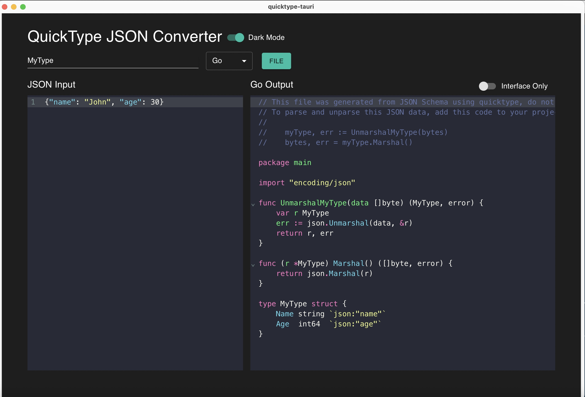

# quicktype-tauri

Welcome to the quicktype-tauri application repository! This application is built using Quicktype, CodeMirror, and Tauri. Below you will find instructions on how to set up and use the application. 


## Table of Contents

- [Introduction](#introduction)
- [Features](#features)
- [Installation](#installation)
- [Usage](#usage)
- [Contributing](#contributing)
- [License](#license)
- [Acknowledgements](#acknowledgements)
- [Contact](#contact)

## Introduction

quicktype-tauri is a powerful and user-friendly application that leverages Quicktype for data transformation, CodeMirror for code editing, and Tauri for building the desktop application. It is designed to make data handling and code manipulation easier and more efficient.

## Features

- **Quicktype Integration**: Seamlessly convert JSON to types in various programming languages.
- **CodeMirror Integration**: A rich text editor with syntax highlighting and various customization options.
- **Tauri Integration**: Build and bundle your application as a lightweight, secure, and performant desktop application.
- **User-friendly Interface**: Intuitive and easy to navigate.
- **Customizable**: Easily extend and customize to fit your needs.

## Installation

To get started with the quicktype-tauri application, follow these steps:

1. Clone the repository:

    ```sh
    git clone https://github.com/yourusername/quicktype-tauri.git
    cd quicktype-tauri
    ```

2. Install the necessary dependencies:

    ```sh
    yarn install
    ```

3. Start the application web:

    ```sh
    yarn dev
    ```

4. Start the application tarui dev/build:
    ```sh
    yarn tarui dev
    yarn tarui build
    ```

## Usage

Once the application is running, you can start using the browser or  application:



## Contributing

We welcome contributions from the community! If you would like to contribute, please follow these steps:

1. Fork the repository.
2. Create a new branch (`git checkout -b feature-branch`).
3. Make your changes.
4. Commit your changes (`git commit -am 'Add new feature'`).
5. Push to the branch (`git push origin feature-branch`).
6. Create a new Pull Request.

Please make sure to follow the [Code of Conduct](CODE_OF_CONDUCT.md) and the [Contributing Guidelines](CONTRIBUTING.md).

## License

This project is licensed under the MIT License. See the [LICENSE](LICENSE) file for more details.

## Acknowledgements

We would like to express our gratitude to the following projects which made this application possible:

- **[Quicktype](https://quicktype.io/)**: For providing a powerful tool to convert JSON into various types.
- **[CodeMirror](https://codemirror.net/)**: For offering a versatile and highly customizable code editor.
- **[Tauri](https://tauri.app/)**: For enabling the creation of lightweight, secure, and performant desktop applications.

## Contact

If you have any questions, suggestions, or issues, please feel free to open an issue or contact us at your.email@example.com.

Thank you for using quicktype-tauri!


